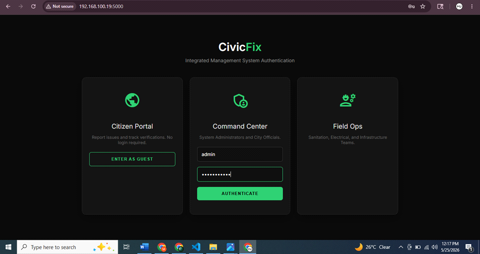
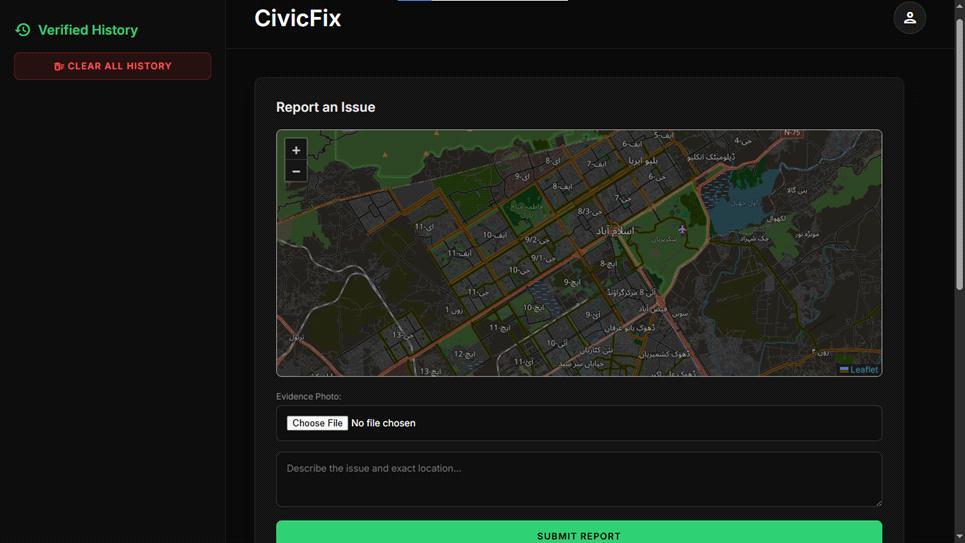
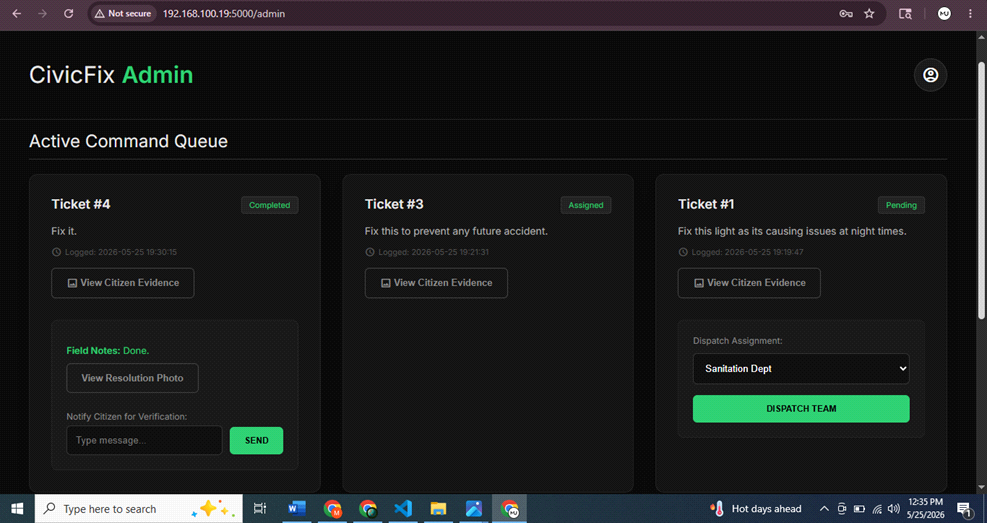
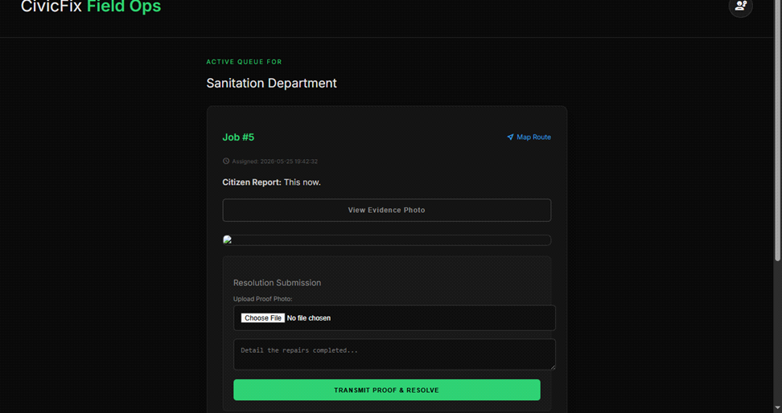

# CivicFix

**A closed-loop civic issue tracking system for Islamabad.**

CivicFix connects citizens, city administrators, and field workers on a single platform so that civic hazards — open manholes, broken streetlights, damaged roads, uncollected garbage — are reported, dispatched, fixed, and **verified by the original reporter** before a ticket can ever be closed.

> 🎓 Semester project — Software Engineering, Department of Cyber Security (NCSA), Air University, Islamabad.

🔗 **Live Demo:** [abdullahsajidmalik.pythonanywhere.com](https://abdullahsajidmalik.pythonanywhere.com/)

---

## 📖 Overview

Most local complaint systems (phone calls, WhatsApp groups, walk-in offices) are **open-loop** — a worker can mark an issue "resolved" with no proof it was actually fixed, and the citizen who reported it has no way to confirm or contest that.

CivicFix closes that loop. Every report carries a photo and GPS coordinates from the start, moves through a transparent four-stage lifecycle, and **cannot be archived until the citizen who filed it personally confirms the fix** by reviewing the worker's proof photo.

```
Pending → Assigned → Completed → Verified
```

## ✨ Features

### 🧑 Citizen Portal
- Report an issue with a photo and a description, pinned on an interactive Leaflet.js map of Islamabad
- Track the live status of every report you've submitted
- Review the field worker's proof-of-repair photo and the admin's note, then **confirm resolution** yourself to close the ticket
- Personal sidebar history of verified tickets, with the option to clear them

### 🛡️ Admin Dashboard ("Command Center")
- Card-based view of all active tickets, grouped by status
- Inspect citizen-submitted evidence photos before dispatching
- Assign a pending ticket to a department (Sanitation / Electrical / Infrastructure)
- Review a worker's completed-job proof photo and send a verification message back to the citizen
- Manage the archive — delete individual verified tickets or clear the whole archive

### ⚙️ Field Worker Portal ("Field Ops")
- Department-specific job queue — workers only see tickets assigned to them
- One-tap link to open the reported location directly in Google Maps for navigation
- Upload a proof-of-repair photo with a repair note to mark a job as completed
- History of completed and verified jobs

### 🔒 Security Hardening
This build includes two fixes applied after the initial prototype:
- **Session-based worker routing** — field workers are identified by their authenticated session (`/worker/dashboard`), not by an exposed name in the URL like `/worker/Worker1`
- **Image content validation** — uploaded files are checked against their actual binary header (`imghdr`) on the server, not just their file extension, so a disguised non-image file (e.g. `payload.exe` renamed to `photo.jpg`) is rejected even if the client-side check is bypassed

## 🖼️ Screenshots

| Login | Citizen Portal |
|---|---|
|  |  |

| Admin Dashboard | Field Worker Portal |
|---|---|
|  |  |

## 🛠️ Tech Stack

| Layer | Technology |
|---|---|
| Backend | Python 3, Flask, Jinja2 |
| Frontend | HTML5, CSS3, Vanilla JavaScript |
| Mapping | Leaflet.js v1.9.4 + OpenStreetMap (free, no API key) |
| Database | SQLite3 |
| Auth | Flask sessions, role-based route decorators |
| File Handling | Werkzeug `secure_filename` + `imghdr` magic-byte validation |

No paid services, no API keys, and no build step — the whole stack is open-source and runs directly with Python.

## 📂 Project Structure

```
CivicFix/
├── app.py                  # All Flask routes, auth, and database logic
├── setup_db.py              # One-time script to create and seed the SQLite database
├── civicfix.db               # SQLite database (created by setup_db.py)
├── requirements.txt            # Python dependencies (flask, werkzeug)
├── Procfile                     # Process file for PythonAnywhere / Heroku-style hosting
├── templates/
│   ├── login.html                # Landing / authentication page
│   ├── index.html                # Citizen Portal
│   ├── admin.html                 # Admin Dashboard
│   └── worker.html                # Field Worker Portal
└── static/
    └── uploads/                  # Citizen evidence photos & worker proof photos
```

> ⚠️ **Important:** Flask looks for HTML files inside a folder named exactly `templates/`. If your local copy has `admin.html`, `index.html`, `login.html`, and `worker.html` sitting in the project root instead, create a `templates` folder and move all four `.html` files into it before running the app — otherwise Flask will throw a `TemplateNotFound` error.
>
> Likewise, `app.py` saves uploaded photos to `static/uploads/`, so make sure that folder exists (create it if missing) before submitting any report.

## 🚀 How to Run Locally

### Prerequisites
- Python 3.10 or newer
- pip

### 1. Clone the repository
```bash
git clone <your-repo-url>
cd CivicFix
```

### 2. Create a virtual environment (recommended)
```bash
python -m venv venv
source venv/bin/activate      # On Windows: venv\Scripts\activate
```

### 3. Install dependencies
```bash
pip install -r requirements.txt
```
(If `requirements.txt` isn't present, just run `pip install flask werkzeug`.)

### 4. Fix the folder structure (if needed)
If `admin.html`, `index.html`, `login.html`, and `worker.html` are sitting in the project root rather than inside a `templates` folder:
```bash
mkdir templates
mv admin.html index.html login.html worker.html templates/
```
Also make sure an uploads folder exists for photos:
```bash
mkdir -p static/uploads
```

### 5. Set up the database
If `civicfix.db` is already included in the repo, you can skip this step. Otherwise, run:
```bash
python setup_db.py
```
This creates `civicfix.db` in the project root with the `Users` and `Reports` tables.

### 6. Run the app
```bash
python app.py
```
Flask will start in debug mode at:
```
http://127.0.0.1:5000/
```

### 7. Using the app
- **Citizens** — click **"Enter as Guest"** on the landing page, no login required
- **Admins / Field Workers** — log in from the **Command Center** / **Field Ops** card with credentials stored in the `Users` table

## 🗺️ Route Map

| Route | Method | Role | Purpose |
|---|---|---|---|
| `/` | GET, POST | — | Login page / authentication |
| `/logout` | GET | — | Clears the session |
| `/citizen` | GET | — | Citizen Portal |
| `/submit` | POST | — | Submit a new report (photo + GPS + description) |
| `/verify` | POST | — | Citizen confirms a resolved ticket |
| `/delete` | POST | — | Citizen removes a verified ticket from their history |
| `/admin` | GET | Admin | Admin Dashboard |
| `/assign_task` | POST | Admin | Dispatch a pending ticket to a department |
| `/admin_message_user` | POST | Admin | Send a verification note to the citizen |
| `/delete_report` | POST | Admin | Permanently delete a single ticket |
| `/clear_history` | POST | Admin | Clear all verified tickets from the archive |
| `/worker/dashboard` | GET | Worker | Worker's department-specific job queue |
| `/upload_proof` | POST | Worker | Upload proof-of-repair photo and comment |

## ⚠️ Known Issues

This is a prototype build from a free-tier deployment, and a few rough edges are still open:

- **HTML files are not yet inside a `templates` folder** in this repository's current upload — see the "Fix the folder structure" step above before running.
- **`requirements.txt.txt`** has a duplicate extension in some uploads — rename it to `requirements.txt` so hosting platforms (and `pip install -r`) pick it up correctly.
- **`Procfile.txt`** should be renamed to `Procfile` (no extension) if you're deploying to a platform that reads a Procfile, such as Heroku-style hosts.
- **Server-side input validation is incomplete.** The image-type check exists, but other form fields (description text, coordinates, etc.) are not yet fully validated/sanitized server-side — this surfaced as bugs on the live free-hosted deployment and is the top priority fix.
- The "Clear Entire Archive" button on the Admin Dashboard calls a `/clear_all_history` endpoint on the frontend that doesn't currently match the `/clear_history` route defined in `app.py`.
- Worker accounts are matched against the `Users` table, but there's no signup flow or password hashing yet — credentials are expected to be seeded directly into the database.
- No automatic spam/duplicate-report filtering in this version.
- Layout has minor overflow issues on very narrow phone screens (<375px).

## 🔭 Future Enhancements

- Proper role-based access control with hashed passwords and JWT sessions
- AI-based duplicate report detection using image similarity + GPS proximity
- Native Android/iOS apps for more reliable GPS and offline report drafting
- Admin analytics dashboard (complaint clustering, average resolution time per department)
- Automated SLA escalation for tickets that sit too long in one stage

## 👥 Team

Built by **Muhammad Usman**, **Abdullah Sajid Malik**, and **Abdul Rehman** as a Software Engineering semester project, supervised by **Dr. Saad**, Department of Cyber Security (NCSA), Air University, Islamabad — May 2026.

## 📄 License

This project was built for academic purposes. Add a license of your choice (MIT recommended) if you intend to open-source it further.
